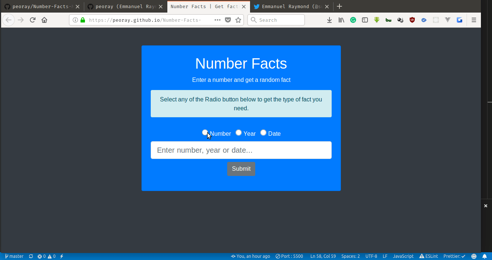

**UPDATE: I finally managed to host the app thanks to The Shalvah**

Check out the app: [code](https://www.github.com/peoray/number-facts-generator/) | [view](https://peoray.github.io/number-facts-generator/)

This is a recent project I completed and I got the inspiration from [Brad Traversy YouTube video](https://www.youtube.com/watch?v=tUE2Nic21BA&list=PLillGF-RfqbbnEGy3ROiLWk7JMCuSyQtX&index=17). I decided to add my own features and include options for both year and date request.

The project is based on the [Numbers API](http://numbersapi.com/#42) where the data is gotten from. The documentation on the usage of the API is pretty straightforward and It’s a free API.

The API is not secured so this prevented me from being unable to host the project live on the web. But to view the project, simply download the code from GitHub and open the `index.html` file with a local live-server. If you are using Visual Studio Code, you can install an extension called live-server (it’s usually the first of the many options you will get with over a million downloads).

The goal of this is to help me practice using the `XMLHttpRequest` API.

Since the User Interface was the same from the tutorial I didn’t waste time on this. My focus was on the JavaScript part.

My first challenge started when I used checkboxes initially but checkboxes are used for choosing different options instead of one. Then when I realize this, I went with radio buttons but I noticed it was the same thing. After Googling around for a solution, I realize I didn’t give the radio buttons the name attribute to link them together as a single option to chose from.

After trying out few things, I got my data returning on the console. I had to install a live-server to enable this to work since we are dealing with an HTTP request. After getting the default data from the API which is almost similar to what was done in the tutorial, I got confused on how to get the data for the date and year option. This was pretty challenging but it didn’t take me time and I was able to figure it out. I decided to use conditionals and it worked.

I then link up the data to the HTML page, then an idea struck me, why not add a tweet button so I can tweet the fact gotten from the inputted value. I had no idea how to do this. After taking forever to Google for a tutorial on how to do it, I eventually found what I was looking for in this [YouTube video](https://www.youtube.com/watch?v=_i5Obbjmiig). I followed the tutorial but my code didn’t work well. I was frustrated, I practically followed the video tutorial so why should mine not work? My first thought was that maybe the API has some changes and this method shown in the video is probably deprecated but on second thought after watching the video again, it struck my mind that I should just use the same variable names as the video did, Viola!! My tweet functionality worked, turned out the variable names are tied to the API itself and should not be changed.

After getting the tweet button to work, the app was almost completed. Normally, I would have felt satisfied but feeling confident, my brain began having a rush of ideas on the project.

<blockquote class="twitter-tweet" data-lang="en"><p lang="en" dir="ltr">R1D12: Added JS functionalities to my day 1 project for <a href="https://twitter.com/hashtag/30days30sites?src=hash&amp;ref_src=twsrc%5Etfw">#30days30sites</a>.<br><br>I think I will continue to find something to fix in my Number Facts project. there is always something to fix or add.<a href="https://twitter.com/hashtag/100DaysOfCode?src=hash&amp;ref_src=twsrc%5Etfw">#100DaysOfCode</a> <a href="https://twitter.com/hashtag/CodeNewbie?src=hash&amp;ref_src=twsrc%5Etfw">#CodeNewbie</a></p>&mdash; Emmanuel Raymond (@super_raay) <a href="https://twitter.com/super_raay/status/955212912846692358?ref_src=twsrc%5Etfw">January 21, 2018</a></blockquote>
<script async src="https://platform.twitter.com/widgets.js" charset="utf-8"></script>

First off I wanted to form input to clear when data has been returned after inputting a value. So that a user can decide to type again, he won’t have to clear the value. I tried different ways I thought was the solution but none worked. My pseudo code would be when data is return, reset the form. That turned out to be a mistake, should have been clear the form. I was using the reset method instead of setting the form input value to an empty string.

Instead of this:

```js
document.getElementById('id').reset();
```

Do this:

```js
document.getElementById('id').value = '';
```

This will set the form input text field to an empty string and make the field blank.

I also wanted this to work when the user clicks a different radio button, say from number to year, the input should clear. This took a while but I finally got a solution from a friend who helped me out. Normally, radio buttons would return a node-list, so I had to loop through them and write the code to clear the form field.

Next up, I wanted the facts text to disappear when a new value is being inputed. I only want it to appear after I click on the button to make the request. I had to tinker on this for a while but finally got it working.

This project provided me with an opportunity to learn a lot especially using the `XMLHttpRequest` and working with the DOM. I did a lot of DOM manipulations in this project that will definitely be useful, moving on to other projects.

I have made 27 commits on the project and still counting.

Thanks to [Gledsley Müller](https://twitter.com/gepetobio) and [The Shalvah](https://twitter.com/theshalvah) for their help and all those who helped review the project and gave feedback.

_**Cheers!**_
